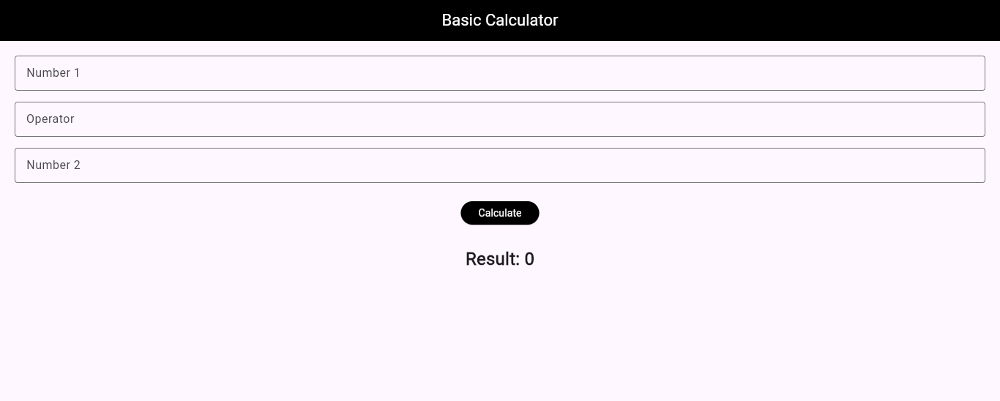
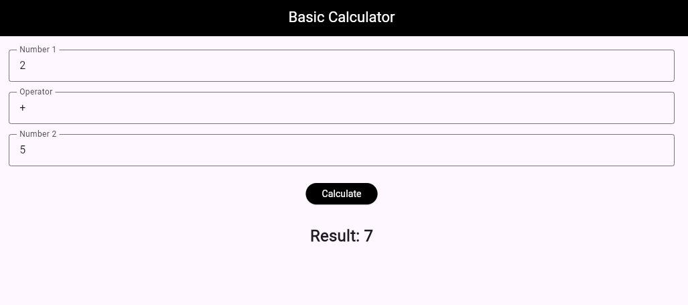

# Experiment 3: Basic Calculator

**Objective:** Implement a calculator using `TextEditingController` and `setState()` for dynamic UI updates.

## Description

A functional arithmetic calculator that accepts two numbers and an operator (`+`, `-`, `*`, `/`) to perform calculations with error handling.

## Key Features

- **Stateful Widget:** Maintains result and updates UI via `setState()`
- **Input Management:** Three `TextEditingController` instances for number and operator inputs
- **Error Handling:** Input validation using `double.tryParse()` and `SnackBar` alerts
- **Operations:** Switch-case logic for arithmetic calculations
- **Resource Cleanup:** Proper disposal of controllers

## Examples

- Addition: 10 + 5 → 15.0
- Division by Zero: 10 / 0 → Error alert
- Invalid Input: abc + 5 → Validation alert
  
  
